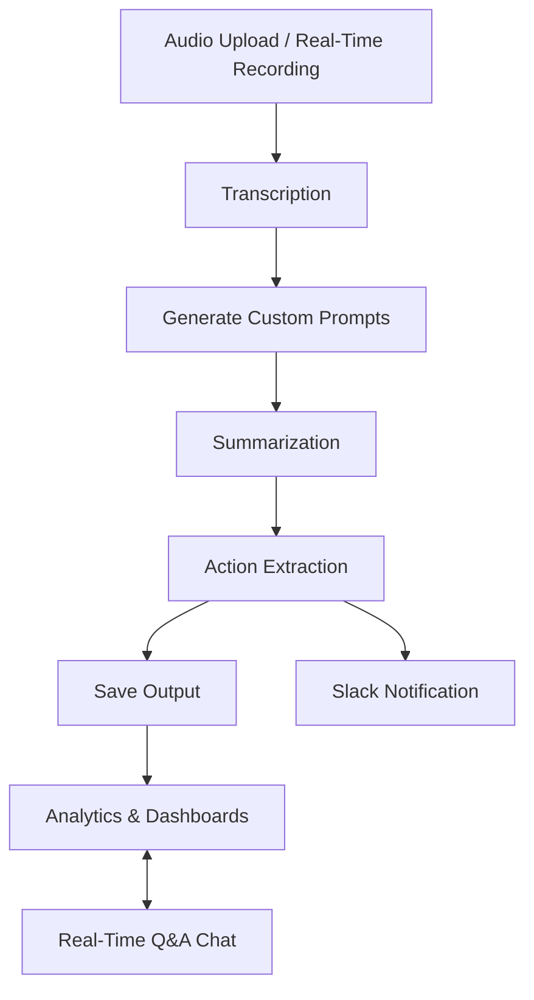

# ✨ Clarity Notes – AI-Powered Meeting Assistant

**Tagline:** Transform your meetings into actionable insights with AI-driven summaries, action items, and analytics 📊🤖

---

## 📝 Project Overview

Clarity Notes is an **AI-powered meeting notes application** designed to:

- 🎤 Transcribe audio/video meetings in multiple languages.
- 🧾 Summarize meeting transcripts with key decisions and outcomes.
- ✅ Extract structured action items with assignees, deadlines, and priority.
- 💬 Provide live Q&A interaction based on meeting context.
- 📈 Generate cross-meeting analytics and insights dashboards.
- 🔔 Optionally notify Slack channels with meeting summaries and actions.

This application leverages **LangChain**, **LangGraph**, and **Groq AI** for LLM-driven insights, combined with a **React frontend** for visualization.

---

## 🚀 Current Features

### Core Functionalities

1. **Meeting Transcription** 🎧  
    - Supports file uploads (mp3, wav) and real-time audio recording.  
    - Multi-language support.  
    - Diarized transcripts for speaker identification.

2. **Summarization** ✍️  
    - Generates concise summaries highlighting decisions, outcomes, and discussion points.  
    - Industry-specific summaries (Finance, Healthcare, Marketing, Education).

3. **Action Item Extraction** ✅  
    - Identifies tasks, assigns responsibility, sets deadlines, and prioritizes actions.  
    - Industry-specific prompts for compliance and privacy.

4. **Real-Time Q&A Chat** 💬  
    - Floating AI assistant for asking questions based on latest meeting transcript and summary.

5. **Feedback Collection** 🌟  
    - Users can submit ratings and comments for each meeting.

6. **Analytics Dashboard** 📊  
    - Meetings over time.  
    - Action trends across meetings.  
    - Sentiment analysis (Positive, Neutral, Negative) for insights.  
    - Industry-specific analytics.

7. **Slack Notifications** 🔔  
    - Optional automated Slack notifications with summaries and action items.

---

## 🌟 Future / Unique Features

- **Cross-Meeting Insights** 🔍  
  Detect trends in action items, recurring decisions, and risks across multiple meetings.

- **Predictive Intelligence** 📈  
  Estimate risk of task delay and ROI tracking for enterprise meetings.

- **Customizable Prompts** 🛠️  
  Generate tailored summary and action prompts for unique business needs.

- **Enhanced Visualizations** 📉  
  Advanced charts and KPI dashboards for executives and team leads.

- **AI-Powered Recommendations** 🤖  
  Suggest next steps or improvements based on historical meeting patterns.

---

## 🗂️ Folder Structure

```bash
backend/
├── src/
│   ├── api.py
│   ├── core/
│   ├── graphs/
│   ├── interfaces/
│   └── utils/
frontend/
├── src/
│   ├── components/
│   ├── App.js
│   └── index.js
uploads/      # Auto-generated files (gitignored)
instance/     # Database (gitignored)
```

---

## ⚡ Workflow / Flow of Data

1. **Upload/Record Meeting Audio** 🎤  
2. **Transcription** → Convert speech to text 📝  
3. **Generate Custom Prompts** 🛠️  
4. **Summarization** ✍️ → Key points, decisions, and insights  
5. **Action Extraction** ✅ → Tasks, deadlines, assignees  
6. **Optional Slack Notification** 🔔 → Send summary and actions  
7. **Save Outputs** 💾 → Markdown / Database  
8. **Analytics Dashboard** 📊 → Insights across meetings  
9. **Real-Time Q&A** 💬 → Ask questions from AI assistant  

## **Flow Diagram (Textual Representation):**



---

## 🛠️ Tech Stack

- **Backend:** FastAPI, Python, SQLite 🐍  
- **Frontend:** React, Bootstrap, Recharts ⚛️  
- **AI/LLM Integration:** LangChain, LangGraph, ChatGroq 🤖  
- **Audio Processing:** PyAudio, Wave 🎧  
- **Real-Time Communication:** Socket.io 💬

---

## ⚙️ Installation

### Backend

```bash
git clone <repo-url>
cd backend
python -m venv venv
source venv/bin/activate  # Linux/macOS
venv\Scripts\activate     # Windows
pip install -r requirements.txt
cp .env.example .env      # Fill API keys and configs
uvicorn src.api:app --reload
```

### Frontend

```bash
cd frontend
npm install
npm start
```

---

## 🖥️ Usage

1. Open the frontend in the browser (default: http://localhost:3000).
2. Upload a meeting audio file or use real-time recording.
3. View automatically generated summary, action items, and insights dashboard.
4. Ask questions to the AI chat assistant.
5. Submit feedback for each meeting.
6. Explore analytics for trends across meetings.

---

## 🤝 Contributing

- Fork the repository.
- Create a new feature branch.
- Ensure code quality and run tests.
- Submit a pull request with a clear description.

---

## 📄 License

This project is licensed under the MIT License.

---

## 📧 Contact

For questions or support, contact Karma Koder at your-email@example.com.

---


